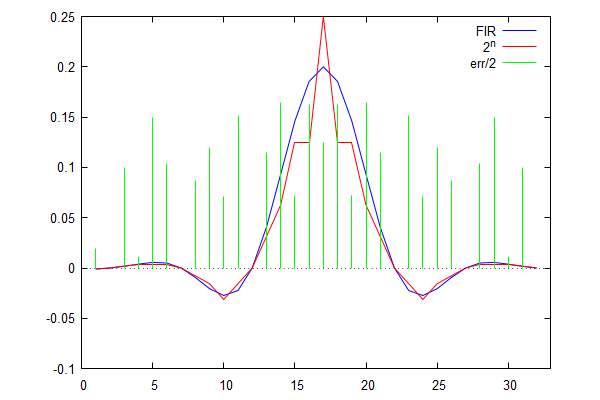
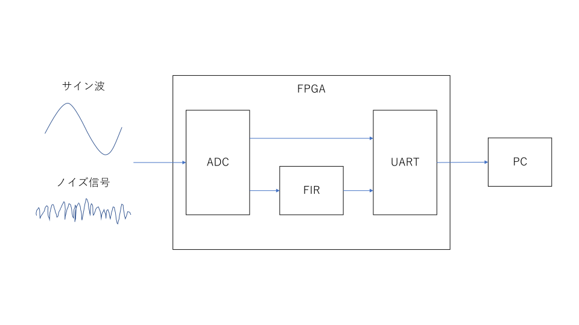

# 2のべき乗を係数としたFIRフィルタの設計

FIRフィルタは入力信号に係数列を乗じ, その移動平均を出力として得る. 係数列は絶対値が1よりも小さいため, この演算では小数点演算が必要となる. そのため乗算器を多数消費し, これがハードウェアでの演算において障壁となる. そこでこの係数列を2のべき乗に置き換えることで, 乗算器の消費を抑えられると予想できる. 本研究では係数列を2のべき乗に置き換え, それによる伝達関数の変化について調べた.

## 係数列の導出

係数列にはハミング窓を選択した. 係数列の置き換えには最小二乗法による近似を用いた. この2のべき乗への置き換えで有効数字の桁数が決まる. ビット幅によって置き換え時の誤差が決まる.

これら係数列の導出はC言語でプログラミングした.

以下に係数列をプロットしたものを示す.

  
[図1:係数列のプロット](fig:h_1)

緑色の線は元の係数列とそれを変換したものとの誤差である. 誤差は全域でほとんど一定の誤差を示している. これは変換した係数列のある値$2^n$の誤差値が$O(2^{n-1})$であることを示している.

係数列は最大で30程度の誤差を持つため, 利得では15[dB]ほどの誤差があると想定できる.

## [伝達関数の評価](sec:tran_func)

前述より係数列の誤差はビット幅に依存することが分かった. また伝達関数はタップ数によって利得が変化する. そのためビット幅とタップ数に注目して伝達関数の評価を行う.

伝達関数の評価にはmaximaを用いた.

評価のパターンは以下の4通りである.

|      | ビット幅 | タップ数 |
| ---- | -------- | -------- |
| 1    | 12       | 31       |
| 2    | 16       | 31       |
| 3    | 12       | 101      |
| 4    | 16       | 101      |

伝達関数のグラフを以下に示す.

  
[図2:伝達関数:12bits,31taps](fig:h_1)

  
[図3:伝達関数:16bits,31taps](fig:h_2)

  
[図4:伝達関数:12bits,101taps](fig:h_3)

  
[図5:伝達関数:16bits,101taps](fig:h_4)

図[2](fig:h_1)と図[3](fig:h_2)との比較からビット幅は伝達関数の利得には影響しないことがわかる. また図[2](fig:h_1)と図[4](fig:h_3)を比較すると図[4](fig:h_3)では通過域でリップルが大きくなっていることがわかる. これは係数列の誤差の影響で, タップ数が増えることで各係数の誤差がリップルとして表れているためである. また阻止域でも図[4](fig:h_3)のリップルは大きく, 結果的に利得はあまり増えていない.

実装とのトレードオフを考えると, タップ数を減らしたほうが効果的である.

## 実装

以下に実装結果を示す. 実装環境はQuartus prime v18.0で, デバイスはcyclone 10 LPを選択した.
```
+----------------------------------------------------------------------------------+
; Flow Summary                                                                     ;
+------------------------------------+---------------------------------------------+
; Flow Status                        ; Successful - Mon Feb 25 19:17:27 2019       ;
; Quartus Prime Version              ; 18.0.0 Build 614 04/24/2018 SJ Lite Edition ;
; Family                             ; Cyclone 10 LP                               ;
; Total logic elements               ; 1,700 / 6,272 ( 27 % )                      ;
;     Total combinational functions  ; 1,644 / 6,272 ( 26 % )                      ;
;     Dedicated logic registers      ; 165 / 6,272 ( 3 % )                         ;
; Total registers                    ; 165                                         ;
; Total memory bits                  ; 204 / 276,480 ( < 1 % )                     ;
; Embedded Multiplier 9-bit elements ; 0 / 30 ( 0 % )                              ;
; Device                             ; 10CL006YE144C6G                             ;
; Timing Models                      ; Final                                       ;
+------------------------------------+---------------------------------------------+
```

先行研究で製作したFIRフィルタの実装結果は以下の通りである.
```
+----------------------------------------------------------------------------------+
; Flow Summary                                                                     ;
+------------------------------------+---------------------------------------------+
; Flow Status                        ; Successful - Mon Feb 25 19:24:20 2019       ;
; Quartus Prime Version              ; 18.0.0 Build 614 04/24/2018 SJ Lite Edition ;
; Family                             ; Cyclone 10 LP                               ;
; Total logic elements               ; 2,512 / 6,272 ( 40 % )                      ;
;     Total combinational functions  ; 2,384 / 6,272 ( 38 % )                      ;
;     Dedicated logic registers      ; 687 / 6,272 ( 11 % )                        ;
; Total registers                    ; 687                                         ;
; Total memory bits                  ; 0 / 276,480 ( 0 % )                         ;
; Embedded Multiplier 9-bit elements ; 0 / 30 ( 0 % )                              ;
; Device                             ; 10CL006YE144C6G                             ;
; Timing Models                      ; Final                                       ;
+------------------------------------+---------------------------------------------+
```
「Total logic elements」の項で7割弱削減することができた. 実装量は通常のFIRフィルタに比べ, 大きく減らすことができたといえる. FIR フィルタの演算の大部分は乗算と加算が占めるが, 今回の実装では乗算のみが削減されたことになる. このことからビット幅の増加に対しては大きく効果があると考えられる. 対してタップ数の増加には加算も増加するため, あまり効果がないと考えられる.

メモリ使用率の増加とレジスタ使用率の減少は記述の違いによるものだと思われる. 設計とは異なるためここでは議論しない.

## 実験結果

実験ではFPGAに今回作成したFIRフィルタのほかに, ADC, UARTを作成した. ADCから得られたデータにフィルタをかけ, 生データとフィルタをかけたデータ（フィルタデータ）をUARTでPCに転送した. ADCで受けた信号はサイン波(1[kHz])とノイズ信号の2種類である. PCに転送したデータはmaximaを用いて解析した.


[図6:実験の概要](fig:setup)

### サイン波

[図7:サイン波のデータ点](fig:sin_plot)


[図8:サイン波のFFT](fig:sin_fft)

図[7](fig:sin_plot)は取得したデータのプロットで図[8](fig:sin_fft)はデータにFFTをかけたものである. 計測開始時点でフィルタにデータがたまっていないため, 図[7](fig:sin_plot)では初めの32データ分が欠測している. アンプによって値が大きくなっているが, フィルタをかけても信号の形状は保たれている. FFTの結果では利得が現れているように見えないが, これは初めの32データが落ちているため, そのデータが影響を与えられていると思われる. 図[8](fig:sin_fft)ではフィルタによる利得の減少がみられないどころか, エイリアシングが起きて
しまっている. これは初めの32データが落ちているため, そのデータが影響を与えられていると考えられる.

### ノイズ信号

[図9:ノイズ信号のデータ点](fig:noise_plot)


[図10:ノイズ信号のFFT](fig:noise_fft)

ノイズ信号では分散に対してデータ数が少ないためわかりずらいが, 図[9](fig:noise_plot)では移動平均による影響が見て取れる. 図[10](fig:noise_fft)では平均値を見ると確かに利得が減っていることがわかる. 数値としては3.1[dB]ほどの減少である. [伝達関数の評価](sec:tran_func)で予想される値よりも小さいが, これは通過域の値も含めた平均値のためである. 通過域を除いて利得の減少量を求めると, 約4.6[db]となり予想に近づく. 図[10](fig:noise_fft)の横軸の100付近に通過域から阻止域の変曲点がみられるはずだが, 図から読みよることは難しい.

## 結論

本研究では2のべき乗を係数としてFIRフィルタを実装した.

係数列の導出は元の係数列に対して最小二乗法を用いて近似した.
係数列の誤差を調べると一定の値であることがわかった.

伝達関数の評価から2のべき乗から成る係数列では, 利得の減少がビット幅とタップ数にはほとんど影響しないことがわかった.
実装する場合にはタップ数を減らして設計すべきであるということがわかった.

2のべき乗を係数としているため, 乗算器をビットシフトで実装することができ,
その結果通常のFIRフィルタに比べ実装量を削減することができた.
FIRフィルタの構成から実装量がビット幅とタップ数にどのように依存するか予想できるが, 
実際にどのようになるかは実装して調べる必要がある.

FPGAにフィルタを実装し, 信号の変化についても調べた.
設計時から利得の減少が少ないこともあり, フィルタの影響はほとんど見られなかった.
データ数を増やして更なる解析が必要である.