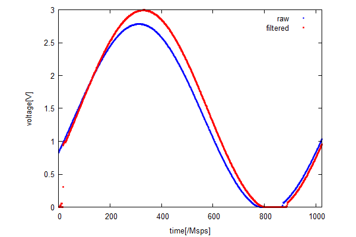

# 2のべき乗を係数としたFIRフィルタの設計

FIRフィルタは入力信号に係数列を乗じ, その移動平均を出力として得る. 係数列は絶対値が1よりも小さいため, この演算では小数点演算が必要となる. そのため乗算器を多数消費し, これがハードウェアでの演算において障壁となる. そこでこの係数列を2のべき乗に置き換えることで, 乗算器の消費を抑えられると予想できる. 本研究では係数列を2のべき乗に置き換え, それによる伝達関数の変化について調べた.

## 係数列の導出

係数列にはハミング窓を選択した. 係数列の置き換えには最小二乗法による近似を用いた. この2のべき乗への置き換えで有効数字の桁数が決まる. ビット幅によって置き換え時の誤差が決まる.

これら係数列の導出はC言語でプログラミングした.

## 伝達関数の評価

前述より係数列の誤差はビット幅に依存することが分かった. また伝達関数はタップ数によって利得が変化する. そのためビット幅とタップ数に注目して伝達関数の評価を行う.

伝達関数の評価にはmaximaを用いた.

評価のパターンは以下の4通りである.

|      | ビット幅 | タップ数 |
| ---- | -------- | -------- |
| 1    | 12       | 31       |
| 2    | 16       | 31       |
| 3    | 12       | 101      |
| 4    | 16       | 101      |

伝達関数のグラフを以下に示す.


[図1](fig:h_1)


[図2](fig:h_2)


[図3](fig:h_3)


[図4](fig:h_4)

[図1](fig:h_1)と[図2](fig:h_2)との比較からビット幅は伝達関数の利得には影響しないことがわかる. また[図1](fig:h_3)と[図3](fig:h_3)を比較すると[図3](fig:h_3)では通過域でリップルが大きくなっていることがわかる. これは係数列の誤差の影響で, タップ数が増えることで各係数の誤差がリップルとして表れているためである. また阻止域でも[図3](fig:h_3)のリップルは大きく, 結果的に利得はあまり増えていない.

実装とのトレードオフを考えると, タップ数を減らしたほうが効果的である.

## 実装

以下に実装結果を示す. 実装環境はQuartus prime v18.0で, デバイスはcyclone 10 LPを選択した.
```
+----------------------------------------------------------------------------------+
; Flow Summary                                                                     ;
+------------------------------------+---------------------------------------------+
; Flow Status                        ; Successful - Mon Feb 25 19:17:27 2019       ;
; Quartus Prime Version              ; 18.0.0 Build 614 04/24/2018 SJ Lite Edition ;
; Family                             ; Cyclone 10 LP                               ;
; Total logic elements               ; 1,700 / 6,272 ( 27 % )                      ;
;     Total combinational functions  ; 1,644 / 6,272 ( 26 % )                      ;
;     Dedicated logic registers      ; 165 / 6,272 ( 3 % )                         ;
; Total registers                    ; 165                                         ;
; Total memory bits                  ; 204 / 276,480 ( < 1 % )                     ;
; Embedded Multiplier 9-bit elements ; 0 / 30 ( 0 % )                              ;
; Device                             ; 10CL006YE144C6G                             ;
; Timing Models                      ; Final                                       ;
+------------------------------------+---------------------------------------------+
```

先行研究で製作したFIRフィルタの実装結果は以下の通りである.
```
+----------------------------------------------------------------------------------+
; Flow Summary                                                                     ;
+------------------------------------+---------------------------------------------+
; Flow Status                        ; Successful - Mon Feb 25 19:24:20 2019       ;
; Quartus Prime Version              ; 18.0.0 Build 614 04/24/2018 SJ Lite Edition ;
; Family                             ; Cyclone 10 LP                               ;
; Total logic elements               ; 2,512 / 6,272 ( 40 % )                      ;
;     Total combinational functions  ; 2,384 / 6,272 ( 38 % )                      ;
;     Dedicated logic registers      ; 687 / 6,272 ( 11 % )                        ;
; Total registers                    ; 687                                         ;
; Total memory bits                  ; 0 / 276,480 ( 0 % )                         ;
; Embedded Multiplier 9-bit elements ; 0 / 30 ( 0 % )                              ;
; Device                             ; 10CL006YE144C6G                             ;
; Timing Models                      ; Final                                       ;
+------------------------------------+---------------------------------------------+
```
「Total logic elements」の項で7割弱削減することができた. 実装量は通常のFIRフィルタに比べ, 大きく減らすことができたといえる. 特にハード乗算器を使用していない.

メモリ使用率の増加とレジスタ使用率の減少は記述の違いによるものだと思われる. 設計とは異なるためここでは議論しない.

## 実験結果

実験ではFPGAに今回作成したFIRフィルタのほかに, ADC, UARTを作成した. ADCから得られたデータにフィルタをかけ, 生データとフィルタをかけたデータ（フィルタデータ）をUARTでPCに転送した. ADCで受けた信号はサイン波(1[kHz])とノイズ信号の2種類である. PCに転送したデータはmaximaを用いて解析した.

### サイン波



FFTの結果では利得が現れているように見えないが, これは初めの32データが落ちているため, そのデータが影響を与えられていると思われる.

### ノイズ信号


## 結論

本研究では2のべき乗を係数としてFIRフィルタを実装した. 2のべき乗を係数としているため, 乗算器をビットシフトで実装することができ, その結果通常のFIRフィルタに比べ大きく実装量を削減することができた. FIRフィルタでは係数は対称に設計されるため, 実装をさらに少なくすることができる. 